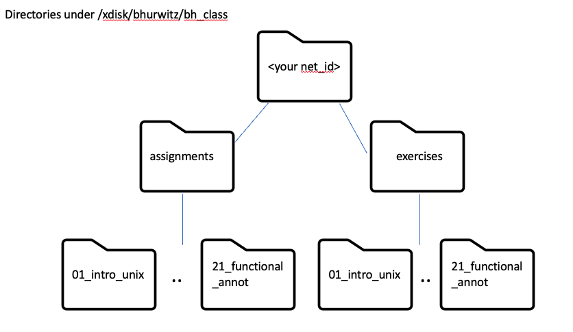

# Introducing the Shell

### Questions:
- "What is a command shell and why would I use one?"
- "How can I move around in a computer?"
- "How can I see what files and directories I have?"
- "How can I specify the location of a file or directory on my computer?"

### Objectives:
- "Describe key reasons for learning shell."
- "Learn how to access a remote machine."
- "Navigate your file system using the command line."
- "Access and read help files for `bash` programs and use help files to identify useful command options."
- "Demonstrate the use of tab completion, and explain its advantages."

### Keypoints:
- "The shell gives you the ability to work more efficiently by using keyboard commands rather than a GUI."
- "Useful commands for navigating your file system include: `ls`, `pwd`, and `cd`."
- "Most commands take options (flags) which begin with a `-`."
- "Tab completion can reduce errors from mistyping and make work more efficient in the shell."


## What is a shell and why should I care?

A *shell* is a computer program that presents a command line interface
which allows you to control your computer using commands entered
with a keyboard instead of controlling graphical user interfaces
(GUIs) with a mouse/keyboard combination.

There are many reasons to learn about the shell.

* Many bioinformatics tools can only be used through a command line interface, or 
have extra capabilities in the command line version that are not available in the GUI.
This is true, for example, of BLAST, which offers many advanced functions only accessible
to users who know how to use a shell.  
* The shell makes your work less boring. In bioinformatics you often need to do
the same set of tasks with a large number of files. Learning the shell will allow you to
automate those repetitive tasks and leave you free to do more exciting things.  
* The shell makes your work less error-prone. When humans do the same thing a hundred different times
(or even ten times), they're likely to make a mistake. Your computer can do the same thing a thousand times
with no mistakes.  
* The shell makes your work more reproducible. When you carry out your work in the command-line 
(rather than a GUI), your computer keeps a record of every step that you've carried out, which you can use 
to re-do your work when you need to. It also gives you a way to communicate unambiguously what you've done, 
so that others can check your work or apply your process to new data.  
* Many bioinformatic tasks require large amounts of computing power and can't realistically be run on your
own machine. These tasks are best performed using remote computers or cloud computing, which can only be accessed
through a shell.

In this lesson you will learn how to use the command line interface to move around in your file system. 

## Accessing the campus HPC
In this class, we will use the campus HPC and web-based portal to access the shell, so we can invest most of our time learning the basics of shell by manipulating some experimental data, instead of dealing with installations. The bioinformatics packages we will use for this class have already been installed on the HPC. Also, we will work with large datasets that can only be run on a server with a significant amount of CPU and memory  (not your laptop!)

To get started, please make sure that you have completed these two steps:

1. Enroll in Netid+ to access [HPC systems](https://webauth.arizona.edu/netid-plus/)

2. Create an [HPC Account] (https://account.arizona.edu), if you don't already have one. 

3. You should have received an email from Dr. Hurwitz saying that you have been added to the bh_class group that she sponsors. If not, email her: bhurwitz@arizona.edu. 

## Testing your HPC account by accessing the shell
 
You can also access the campus HPC from the [UA HPC Online portal](https://ood.hpc.arizona.edu/pun/sys/dashboard). Be sure to bookmark this page for future use! 
* To get to the shell, go to the top menu bar select "Clusters" and "Shell access" from the pull-down list.
* To get to a Jupyter notebook for the homework, go to the top menu bar and select "Interactive apps" and "Jupyter notebook" from the pull-down menu.  

## Logging in to the shell from your laptop
You can also login to a shell directly from your laptop instead of the online hpc portal. If you get serious about running bioinformatics analyses, you will likely want to do this. But, it is not necessary for the class. Here are instructions for accessing a terminal on different laptops:
<details>
  <summary markdown="span">Windows</summary>
<ul>
Download the <a href="https://git-for-windows.github.io/">Git for Windows installer</a>. 
Run the installer and follow the steps below:
<li>Click on "Next" four times (two times if you've previously installed Git). You don't need to change anything in the information, location, components, and start menu screens.</li>
<li>Select "Use the nano editor by default" and click on "Next".
<li>Keep "Use Git from the Windows Command Prompt" selected and click on "Next". If you forget to do this, the programs that you need for the workshop will not work properly. If this happens, rerun the installer and select the appropriate option.
<li>Select "Use bundled OpenSSH" and click on "Next".
<li>Select "Use the OpenSSL Library" and click "Next".
<li>Keep "Checkout Windows-style, commit Unix-style line endings" selected and click on "Next".
<li>Select "Use Windows' default console window" and click on "Next".
<li>Select "Default (fast-forward on merge)" and click on "Next".
<li>Select "None" (Do not use a credential helper) and click on "Next".
<li>Select "Enable file system caching" and click on "Next".
<li>Ignore "Configuring experimental options" and click on "Install".
<li>Click on "Install".
<li>Click on "Finish".
<li>If your "HOME" environment variable is not set (or you don't know what this is):
<li>Open command prompt (Open Start Menu, then type `cmd` and press [Enter])
<li>Type the following line into the command prompt window exactly as shown: `setx HOME "%USERPROFILE%"`
<li>Press [Enter], and you should see `SUCCESS: Specified value was saved.`
<li>Quit the command prompt by typing `exit` and then pressing [Enter]
<li>See the [video tutorial](https://youtu.be/yo7Z-BEG62A) for an example of how to install Git on Windows 11.
</ul>  
<br>
An alternative option is to install PuTTY by going to <a href="https://www.chiark.greenend.org.uk/~sgtatham/putty/latest.html"> the installation page</a>. For most newer computers, click on putty-64bit-X.XX-installer.msi to download the 64-bit version. If you have an older laptop, you may need to get the 32-bit version putty-X.XX-installer.msi. If you aren't sure whether you need the 64 or 32-bit version, you can check your laptop version by following [the instructions here](https://support.microsoft.com/en-us/help/15056/windows-32-64-bit-faq). Once the installer is downloaded, double-click on it, and PuTTY should install.
<br>
Another alternative option is to use the Windows Subsystem Linux (WSL). This option is available for Windows 10 and Windows 11 - detailed <a href="https://learn.microsoft.com/en-us/windows/wsl/install">instructions are available here</a>. See the <a href="https://youtu.be/YoNdTuN-YWk">video tutorial</a> for an example of how to install WSL with Ubuntu 22.04 on Windows 11.
</ul>
</details>
<details>
  <summary markdown="span">Mac</summary>
The default shell in some versions of macOS is Bash, and Bash is available in all versions, so no need to install anything. You access Bash from the Terminal Application (found in /Applications/Utilities). See how to open the terminal in the [video tutorial](https://www.youtube.com/watch?v=FuNsWg_VzeQ). You can keep the terminal in your dock for this class.
</details>

<details>
  <summary markdown="span">Linux</summary>
The default shell is usually Bash, and there is usually no need to install anything. To see if your default shell is Bash type, echo $SHELL in a terminal and press Enter. If the message printed does not end with `/bash`, then your default is something else, and you can run Bash by typing `bash`.
</details>
<br>

If you are accessing the shell from your laptop, you need to log in using the `ssh` command (ssh stands for Secure Shell), your username and the address of the machine you are logging into.

```
$ ssh bhurwitz@hpc.arizona.edu
```

When you are prompted to type the password, and use duo mobile for 2-factor authentication. Take into account that while you are typing a password no characters will appear on the screen, trust that they are being typed and press enter. 

After logging in, you will see a screen showing something like this: 

~~~
Last login: Fri Aug 18 13:36:52 2023 from c-71-226-40-183.hsd1.az.comcast.net
This is a bastion host used to access the rest of the RT/HPC environment.

Type "shell" to access the job submission hosts for all environments
-----------------------------------------

[bhurwitz@gatekeeper ~]$ 

~~~

This provides a lot of information about the remote server that you're logging in to. In this case, we are logging into the gatekeeper node. This is the node that is the "gateway" to the clusters at UA. In our case, we want to go the the ocelote cluster (our teaching cluster). To do this, we use the "shell" command and then type "ocelote" on the command line to go to the ocelote cluster.

~~~
[bhurwitz@gatekeeper ~]$ shell
Last login: Fri Aug 18 11:24:47 2023 from ood.hpc.arizona.edu
***
The default cluster for job submission is Puma
***
Shortcut commands change the target cluster
-----------------------------------------
Puma:
$ puma
(puma) $
Ocelote:
$ ocelote
(ocelote) $
ElGato:
$ elgato
(elgato) $
-----------------------------------------

(puma) [junonia@/home/u20/bhurwitz]$ ocelote
~~~

Once you login, the system will send you to your home directory. In my case, this is "/home/u20/bhurwitz". 

## Navigating your file system

The part of the operating system responsible for managing files and directories is called the **file system**.
It organizes our data into files, which hold information,
and directories (also called "folders"), which hold files or other directories.

Several commands are frequently used to create, inspect, rename, and delete files and directories.

The dollar sign is a **prompt**, which shows us that the shell is waiting for input;
your shell may use a different character as a prompt and may add information before the prompt. When typing commands, either from these lessons or from other sources, do not type the prompt, only the commands that follow it. In this lesson we will use the dollar sign to indicate the prompt. 

~~~
$
~~~

Let's find out where we are by running a command called `pwd`
(which stands for "print working directory").
At any moment, our **current working directory**
is our current default directory,
i.e.,
the directory that the computer assumes we want to run commands in
unless we explicitly specify something else.
Here, the computer's response is `/home/u20/bhurwitz`,
which is my home directory.

~~~
$ pwd
~~~

~~~
/home/u20/bhurwitz
~~~

Let's look at how our file system is organized. We can see what files and subdirectories are in this directory by running `ls`,
which stands for "listing":

~~~
$ ls
~~~

~~~
ondemand  scripts  teaching
~~~

`ls` prints the names of the files and directories in the current directory in alphabetical order, arranged neatly into columns. 

Your home directory has a limited amount of space. And because our metagenomics files are large, we are going to be working in the `/xdisk/bhurwitz/bh_class/<your_netid>` directory, where you will create new subdirectories throughout this class.  

The command to change locations in our file system is `cd` followed by a directory name to change our working directory.
`cd` stands for "change directory".

Let's say we want to navigate to the `/xdisk/bhurwitz/bh_class/<your_netid>` directory we saw above (where you swap out <your_netid> with your own netid).  We can use the following command to get there:

~~~
$ cd /xdisk/bhurwitz/bh_class/<your_netid>
~~~

Let's look at what is in this directory:

~~~
$ ls
~~~

~~~
assignments exercises
~~~

We can make the `ls` output more comprehensible by using the **flag** `-F`, which tells `ls` to add a trailing `/` to the names of directories, or other symbols to identify the type of elements in the directory:

~~~
$ ls -F
~~~

~~~
assignments/  exercises/
~~~

Anything with a "/" after it is a directory. Things with a "*" after them are programs. If there are no decorations, it's a file.

To understand a little better how to move between folders, let's look at the following image:

<a href="../fig/directory_structure.png">
  
</a>

Here we can see a diagram of how the folders are arranged one inside another. In this way, if we think about moving from your directory to the assignments folder, the path must go as they are ordered: `cd <your_net_id>/exercises`

`ls` has lots of other options. To find out what they are, we can type:

~~~
$ man ls
~~~

Some manual files are very long. You can scroll through the file using
your keyboard's down arrow or use the <kbd>Space</kbd> key to go forward one page and the <kbd>b</kbd> key to go backwards one page. When you are done reading, hit <kbd>q</kbd> to quit.

> ## Excercise 1: Extra information with `ls -l`
> Use the `-l` option for the `ls` command to display more information for each item 
> in the directory. What is one piece of additional information this long format
> gives you that you don't see with the bare `ls` command?
>
<details>
  <summary markdown="span">Solution</summary>

~~~
$ ls -l
~~~

~~~
drwxrwsr-x. 2 bhurwitz bh_class 0 Aug 21 20:47 01_intro_unix
drwxrwsr-x. 2 bhurwitz bh_class 0 Aug 21 20:47 02_bash_scripting
drwxrwsr-x. 2 bhurwitz bh_class 0 Aug 21 20:47 03_intro_hpc
drwxrwsr-x. 2 bhurwitz bh_class 0 Aug 21 20:47 04_project_setup
drwxrwsr-x. 2 bhurwitz bh_class 0 Aug 21 20:47 05_getting_data
drwxrwsr-x. 2 bhurwitz bh_class 0 Aug 21 20:47 06_qc_trimming
drwxrwsr-x. 2 bhurwitz bh_class 0 Aug 21 20:47 07_contam_removal
drwxrwsr-x. 2 bhurwitz bh_class 0 Aug 21 20:47 08_assembly
drwxrwsr-x. 2 bhurwitz bh_class 0 Aug 21 20:47 09_assembly_qc
drwxrwsr-x. 2 bhurwitz bh_class 0 Aug 21 20:47 10_metag_binning
drwxrwsr-x. 2 bhurwitz bh_class 0 Aug 21 20:47 11_taxonomy
drwxrwsr-x. 2 bhurwitz bh_class 0 Aug 21 20:47 12_phyloseq
drwxrwsr-x. 2 bhurwitz bh_class 0 Aug 21 20:47 13_microviz
drwxrwsr-x. 2 bhurwitz bh_class 0 Aug 21 20:47 14_alpha_diversity
drwxrwsr-x. 2 bhurwitz bh_class 0 Aug 21 20:47 15_beta_diversity_1
drwxrwsr-x. 2 bhurwitz bh_class 0 Aug 21 20:47 16_beta_diversity_2
drwxrwsr-x. 2 bhurwitz bh_class 0 Aug 21 20:47 17_ordination
drwxrwsr-x. 2 bhurwitz bh_class 0 Aug 21 20:47 18_abundance_trans
drwxrwsr-x. 2 bhurwitz bh_class 0 Aug 21 20:47 19_pca_taxon_stats
drwxrwsr-x. 2 bhurwitz bh_class 0 Aug 21 20:47 20_kmer_comparisons
drwxrwsr-x. 2 bhurwitz bh_class 0 Aug 21 20:47 21_functional_annot
~~~

The additional information given includes the name of the owner of the file, when the file was last modified, and whether the current user has permission to read and write to the file.

</details>

<br>

No one can possibly learn all of these arguments, that's why the manual page is for. You can (and should) refer to the manual page or other help files as needed.

OK, let's get started with working with some real data. Make sure you have a shell open, and then let's go into the `/xdisk/bhurwitz/bh_class/**your_netid**/exercises/data/untrimmed_fastq` directory and see what is in there. Be sure to replace **your_netid** below.

~~~
$ cd /xdisk/bhurwitz/bh_class/**your_netid**/exercises/data/untrimmed_fastq
$ ls
~~~

~~~
JC1A_R1.fastq.gz  JC1A_R2.fastq.gz  JP4D_R1.fastq.gz  JP4D_R2.fastq.gz  TruSeq3-PE.fa
~~~

This directory contains a file `TruSeq3-PE.fa`, that we will use in a later lesson and four files with `.fastq.gz` extensions. FASTQ is a format for storing information about sequencing reads and their quality. GZ is an archive file compressed. We will be learning more about FASTQ files in a later lesson. These data come in a compressed format, which is why there is a `.gz` at the end of the files. 
This makes it faster to transfer, and allows it to take up less space on our computer.

Let's copy these files into 

Let's use `gunzip` to decompress the files in your data directory so we can look at the FASTQ format. Notice that I can unzip all of the fastq files at once using the '*' character to indicate the pattern. 
~~~
$ gzip *fastq.gz
$ ls
~~~

~~~
JC1A_R1.fastq  JC1A_R2.fastq  JP4D_R1.fastq  JP4D_R2.fastq  TruSeq3-PE.fa
~~~

### Shortcut: Tab Completion

Usually the key Tab is located on the left side of the keyboard just above the "Shift" key or "Caps lock" key. 

Typing out file or directory names can waste a lot of time and it's easy to make typing mistakes. Instead we can use tab complete 
as a shortcut. When you start typing out the name of a directory or file, then hit the <kbd>Tab</kbd> key, the shell will try to fill in the rest of the directory or file name for you.

Let's try. Go back one directory

~~~
$ cd ..
~~~

then enter:

~~~
$ cd da<tab>
~~~

The shell will fill in the rest of the directory name for
`data`.

Now change directories to `data`

~~~
$ cd data
~~~

Using tab complete can be very helpful. However, it will only autocomplete a file or directory name if you've typed enough characters to provide a unique identifier for the file or directory you are trying to access.

After going to our `data` directory, we can try to access one of our sample files:

~~~
$ cd data/untrimmed_fastq
$ ls JC<tab>
~~~

The shell auto-completes your command to `JC1A_R`, because there is another file name in the directory begin with this prefix. When you hit
<kbd>Tab</kbd> again, the shell will list the possible choices.

~~~
$ ls JC1A_R<tab><tab>
~~~

~~~
JC1A_R1.fastq  JC1A_R2.fastq
~~~

Tab completion can also fill in the names of programs, which can be useful if you remember the beginning of a program name.

~~~
$ pw<tab><tab>
~~~

~~~
pwd   pwdx
~~~

Displays the name of every program that starts with `pw`. 

## Summary

We now know how to move around our file system using the command line.
This gives us an advantage over interacting with the file system through a Graphical User Interface (GUI) as it allows us to work on a remote server, carry out the same set of operations on a large number of files quickly, and opens up many opportunities for using bioinformatics software that is only available in command line versions. 

In the next few exercises, we'll be expanding on these skills and seeing how using the command line shell enables us to make our workflow more efficient and reproducible.

## Key Points
- "The shell gives you the ability to work more efficiently by using keyboard commands rather than a GUI."
- "Useful commands for navigating your file system include: `ls`, `pwd`, and `cd`."
- "Most commands take options (flags) which begin with a `-`."
- "Tab completion can reduce errors from mistyping and make work more efficient in the shell."
