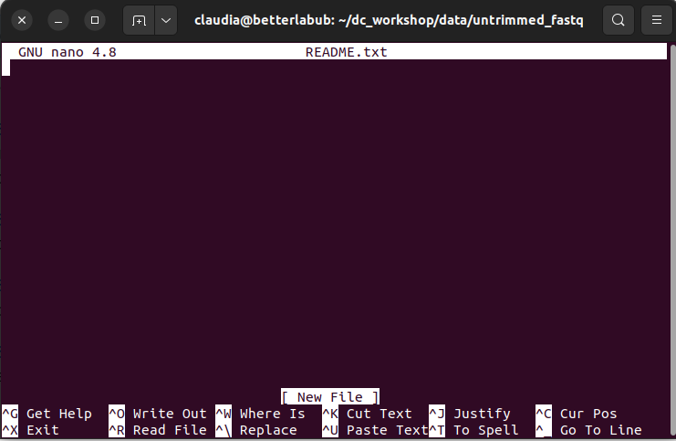
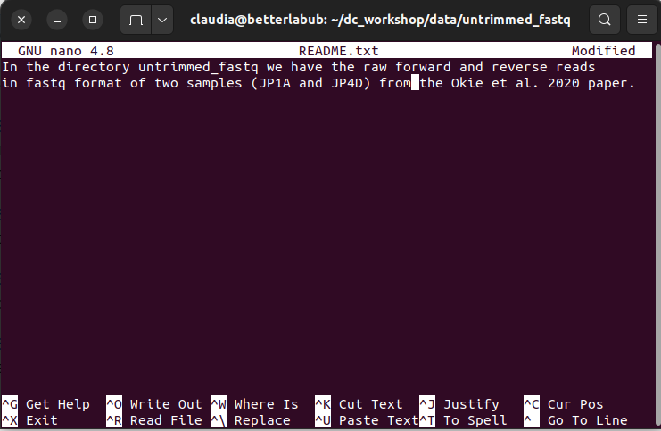

# Writing Scripts and Working with Data

### Questions:
- How can we automate a commonly used set of commands?
- How can we transfer files between local and remote computers?

### Objectives:
- Use the `nano` text editor to modify text files.
- Write a basic shell script.
- Use the `bash` command to execute a shell script.
- Use `chmod` to make a script an executable program.

### Keypoints:
- Scripts are a collection of commands executed together.
- Scripts are executable text files.
- Nano is a text editor.
- In a terminal, `scp` transfers information to and from virtual and local computers.
- R studio remote interface allows the transfer of information between 


## Writing files

We have been able to do much work with existing files, but what if we want to write our own files? We are not going to type in a FASTA file, but we will see as we go through other in-class exercises; there are many reasons we will want to write a file or edit an existing file.

We will use a text editor called Nano to add text to files. We are going to create a file to take notes about what we have been doing with the data files in `/xdisk/bhurwitz/bh_class/your_netid/exercises/data/untrimmed_fastq`.

Taking notes is good practice when working in bioinformatics. We can create a file called a `README.txt` that describes the data files in the directory or documents how the files in that directory were generated. As the name suggests, it is a file that others should read to understand the information in that directory.

Let's change our working directory to `/xdisk/bhurwitz/bh_class/your_netid/exercises/data/untrimmed_fastq` using `cd`,
then run `nano` to create a file called `README.txt`:

```
$ cd /xdisk/bhurwitz/bh_class/your_netid/exercises/data/untrimmed_fastq
$ nano README.txt
```

You should see something like this: 

<a href="../fig/02-05-01.png">
  
</a>
<em> Figure 1. GNU Nano Text Editor Menu. <em/>

The text at the bottom of the screen shows the keyboard shortcuts for performing various tasks in `nano`. We will talk more about how to interpret this information soon.

> ## Which Editor?
>
> When we say, "`nano` is a text editor," we really do mean "text": it can
> only work with plain character data, not tables, images, or any other
> human-friendly media. We use it in examples because it is one of the 
> least complex text editors. However, because of this trait, it may 
> not be powerful enough or flexible enough for the work you need to do
> after this class. On Unix systems (such as Linux and Mac OS X),
> many programmers use [Emacs](http://www.gnu.org/software/emacs/) or
> [Vim](http://www.vim.org/) (both of which require more time to learn), 
> or a graphical editor such as
> [Gedit](http://projects.gnome.org/gedit/). On Windows, you may wish to
> use [Notepad++](http://notepad-plus-plus.org/). Windows also has a built-in
> editor called `notepad` that can be run from the command line in the same
> way as `nano` for the purposes of this lesson.  
>
> No matter what editor you use, you need to know where it searches
> for and saves files. If you start it from the shell, it will (probably)
> use your current working directory as its default location. If you use
> your computer's start menu, it may want to save files in your desktop or
> documents directory instead. You can change this by navigating to
> another directory the first time you "Save As..."


Let us type in a few lines of text. Describe the files in this directory and describe you have been doing with them.
    <a href="../fig/02-05-02.png">
  
</a>
<em> Figure 2. For example, the README file is written in nano. <em/>
    
Once we are happy with our text, we can press <kbd>Ctrl</kbd>-<kbd>O</kbd> (press the <kbd>Ctrl</kbd> or <kbd>Control</kbd> key and, while
holding it down, press the <kbd>O</kbd> key) to write our data to disk. You will be asked what file we want to save this to:
Press <kbd>Return</kbd> to accept the suggested default of `README.txt`.

Once our file is saved, we can use <kbd>Ctrl</kbd>-<kbd>X</kbd> to quit the editor and
return to the shell.

> ## Control, Ctrl, or ^ Key
>
> The Control key is also called the "Ctrl" key. There are various ways
> in which using the Control key may be described. For example, you may
> see an instruction to press the <kbd>Ctrl</kbd> key and, while holding it down,
> press the <kbd>X</kbd> key, described as any of:
>
> * `Control-X`
> * `Control+X`
> * `Ctrl-X`
> * `Ctrl+X`
> * `^X`
> * `C-x`
>
> In `nano`, along the bottom of the screen, you will see `^G Get Help ^O WriteOut`.
> This means that you can use <kbd>Ctrl</kbd>-<kbd>G</kbd> to get help and <kbd>Ctrl</kbd>-<kbd>O</kbd> to save your
> file.

Now you have written a file. You can look at it with `less` or `cat`, or open it up again and edit it with `nano`.

> ## Exercise 1: Edit a file with nano
>
> Open `README.txt`, add the date to the top of the file, and save the file. 
>
<details>
  <summary markdown="span">Solution</summary>
  <ul>

```
Use `nano README.txt` to open the file.  
Add today's date and then use Ctrl X to exit and `y` to save.
```
</details>

## Writing scripts

A really powerful thing about the command line is that you can write scripts. Scripts let you save commands to run them and also lets you put multiple commands together. Though writing scripts may require an additional time investment initially, this can save you time as you run them repeatedly. Scripts can also address the challenge of reproducibility: if you need to repeat analysis, you retain a record of your command history within the script.

One thing we will commonly want to do with sequencing results is pull out bad reads and write them to a file to see if we can figure out what is going on with them. We are going to look for reads with long sequences of N's like we did before, but now we are going to write a script, so we can run it each time we get new sequences rather than type the code in by hand each time.

Bad reads have a lot of N's, so we are going to look for  `NNNNNNNNNN` with `grep`. We want the whole FASTQ record, so we are also going to get the one line above the sequence and the two lines below. We also want to look at all the files that end with `.fastq`, so we will use the `*` wildcard.

```
grep -B1 -A2 NNNNNNNNNN *.fastq > scripted_bad_reads.txt
```

We are going to create a new file to put this command in. We will call it `bad-reads-script.sh`. The `sh` is not required, but using that extension tells us it is a shell script.

```
$ nano bad-reads-script.sh
```

Type your `grep` command into the file and save it as before. Be careful not to add the `$` at the beginning of the line.

Now comes the neat part. We can run this script. Type:

```
$ bash bad-reads-script.sh
```

It will look like nothing happened, but now if you look at `scripted_bad_reads.txt`, you can see that there are now reads in the file.


> ## Exercise 2: Edit a script
>
> We want the script to tell us when it is done. Try using the `echo` command to let the user know the script is done.  
> 
<details>
  <summary markdown="span">Solution</summary>
  <ul>

```
1. Open `bad-reads-script.sh` and add the line `echo "Script finished!"` after the `grep` command and save the file.  
2. Run the updated script.
```

</details>

## Making the script into a program

We had to type `bash` because we needed to tell the computer what program to use to run this script. Instead, we can turn this script into its own program. We need to tell it that it is a program by making it executable. We can do this by changing the file permissions. We talked about permissions in an earlier class.

First, let us look at the current permissions.

```
$ ls -l bad-reads-script.sh
```

```
-rw-rw-r-- 1 user user 0 Aug 25 21:46 bad-reads-script.sh
```


We see that it says `-rw-r--r--`. This combination shows that the file can be read by any user and written to by the file owner (you). We want to change these permissions so the file can be executed as a program. We use the command `chmod` as we did earlier when we removed write permissions. Here we are adding (`+`) executable permissions (`+x`).

```
$ chmod +x bad-reads-script.sh
```

Now let us look at the permissions again.

```
$ ls -l bad-reads-script.sh
```

```
-rwxrwxr-x 1 user user 0 Aug 25 21:46 bad-reads-script.sh
```

Now we see that it says `-rwxr-xr-x`. The `x`'s there now tell us we can run it as a program. So, let us try it! We will need to put `./` at the beginning, so the computer knows to look here in this directory for the program.

```
$ ./bad-reads-script.sh
```

The script should run the same way as before, but now we have created our own computer program!

It is good practice to keep any large files compressed while not using them. In this way, you save storage space; you will see that you will appreciate it when you advance your analysis. So, since we will not use the FASTQ files for now, let us compress them. Moreover, run `ls -lh` to confirm that they are compressed. 

```
$ cd /xdisk/bhurwitz/bh_class/your_netid/exercises/data/untrimmed_fastq
$ gzip *.fastq
$ ls -lh  *.fastq.gz
```


```
total 428M
-rw-r--r-- 1 user user  24M Aug 26 12:36 JC1A_R1.fastq.gz
-rw-r--r-- 1 user user  24M Aug 26 12:37 JC1A_R2.fastq.gz
-rw-r--r-- 1 user user 179M Aug 26 12:44 JP4D_R1.fastq.gz
-rw-r--r-- 1 user user 203M NAug 26 12:51 JP4D_R2.fastq.gz
```

## Moving and downloading data

So far, we have worked with pre-loaded data on the hpc. Usually, however, most analyses begin with moving data onto the hpc. Below we will show you some commands to download data onto the hpc or to move data between your computer and the hpc.

### Getting data to/from the HPC

Two programs will download data from a remote server to your local
(or remote) machine: ``wget`` and ``curl``. They were designed to do slightly different tasks by default, so you will need to give the programs somewhat different options to get the same behavior, but they are mostly interchangeable.

 - ``wget`` is short for "world wide web get", and its basic function is to *download*

 - ``cURL`` is a pun. It is supposed to be read as "see URL", so its primary function is
 to *display* webpages or data at a web address.

Which one you need to use mainly depends on your operating system, as most computers will
only have one or the other installed by default.

Let us say you want to download some data from Ensembl. We will download a tiny
tab-delimited file that tells us what data is available on the Ensembl bacteria server.
Before starting our download, we need to know whether we are using ``curl`` or ``wget``.

To see which program you have, type:
 
```
$ which curl
$ which wget
```

``which`` is a BASH program that looks through everything you have
installed and tells you what folder it is installed to. If it cannot
find the program you asked for, it returns nothing, i.e., it gives you no
results.

On the hpc, you will likely get the following output:

```
$ which curl
```

```
/usr/bin/curl
```


```
$ which wget
```

```
/usr/bin/wget
```

This output means that you have both ``curl`` and ``wget`` installed.

Now we can use one of the following commands to download the file to your home directory:

```
$ cd
$ wget ftp://ftp.ensemblgenomes.org/pub/release-37/bacteria/species_EnsemblBacteria.txt
```

or

```
$ cd
$ curl -O ftp://ftp.ensemblgenomes.org/pub/release-37/bacteria/species_EnsemblBacteria.txt
```

Since we wanted to *download* the file rather than view it, we used ``wget`` without any modifiers. With ``curl`` however, we had to use the -O flag, which simultaneously tells ``curl`` to download the page instead of showing it to us **and** specifies that it should save the
file using the same name it had on the server: species_EnsemblBacteria.txt

It's important to note that both ``curl`` and ``wget`` download to the computer that the command line belongs to. So, if you are logged into AWS on the command line and execute the ``curl`` command above in the AWS terminal, the file will be downloaded to your AWS machine, not your local one.

### Moving files between your laptop and the HPC

What if the data you need is on your local computer, but you need to get it *onto* the HPC? Or, what if you need to download files from the HPC to your laptop. Here is how you can do it!
       
### Upload/Download small files between the HPC and your laptop.  
    
If your files are small, you can use the online [HPC portal](https://ood.hpc.arizona.edu/) and select the file browser from the top menu to get easy access for transferring files to/from your /home, /xdisk, and /groups directories. You can also view, edit, copy, and rename your files. 
    
### Transferring larger data files between your local machine and the HPC with `scp`  
    
`scp` stands for 'secure copy protocol' and is a widely used UNIX tool for moving files between computers. The simplest way to use `scp` is to run it in your local terminal and use it to copy a single file. 

You will need to use an SSH v2 compliant terminal to move files to/from HPC. For more information on using SCP, use man scp.

Moving a File or Directory to the HPC:

<details>
  <summary markdown="span">Mac OS</summary>
  <ul>
In your terminal, navigate to the desired working directory on your local machine (laptop or desktop usually). To move a file or directory to a designated subdirectory in your account on HPC:

```
$ scp -rp filenameordirectory NetId@filexfer.hpc.arizona.edu:subdirectory
Getting a File or Directory From the HPC:
```

In your terminal, navigate to the desired working directory on your local machine. The copy a remote file from HPC to your current directory:

```
$ scp -rp NetId@filexfer.hpc.arizona.edu:filenameordirectory .
** the space folllowed by a period at the end means the destination is the current directory** 
```

</details>

<details>
  <summary markdown="span">PC</summary>
  <ul>
Windows users can use software like WinSCP to make SCP transfers. To use WinSCP, first download/install the software from: https://winscp.net/eng/download.php

To connect, enter filexfer.hpc.arizona.edu in the Host Name field, enter your NetID under User name, and enter your password. Accept by clicking Login. You'll be prompted to Duo Authenticate.

</details>

<br>

Wildcards

Wildcards can be used for multiple file transfers (e.g. all files with .dat extension). Note the backslash " \ " preceding *

$ scp NetId@filexfer.hpc.arizona.edu:subdirectory/\*.fastq ~/Downloads
  
> ## Exercise 3: Downloading data with `scp`  
> Let's say we want to download a text file `/xdisk/bhurwitz/bh_class/your_netid/exercises/data/untrimmed_fastq/scripted_bad_reads.txt` from the hpc to your local computer. Note you will perform this action from a shell on your local computer.
> Which of the following commands would download the file?  
> A)  
> ```
> $  scp local_file.txt your_netid@filexfer.hpc.arizona.edu:/xdisk/bhurwitz/bh_class/your_netid/exercises/data/untrimmed_fastq/
> ```

> B)  
> ```
> $ scp your_netid@filexfer.hpc.arizona.edu:/xdisk/bhurwitz/bh_class/your_netid/exercises/data/untrimmed_fastq/scripted_bad_reads.txt ~/Downloads
> ```

<details>
  <summary markdown="span">Solution</summary>
  <ul>
<li>A) False. This command will upload the file `local_file.txt` to the /xdisk/bhurwitz/bh_class/your_netid/exercises/data/untrimmed_fastq/ directory.</li>
<li>B) True. This option downloads the bad reads file in `/xdisk/bhurwitz/bh_class/your_netid/exercises/data/untrimmed_fastq/` to your local `~/Downloads` directory. Be sure to execute this from your local machine.</li>
  
</details>
