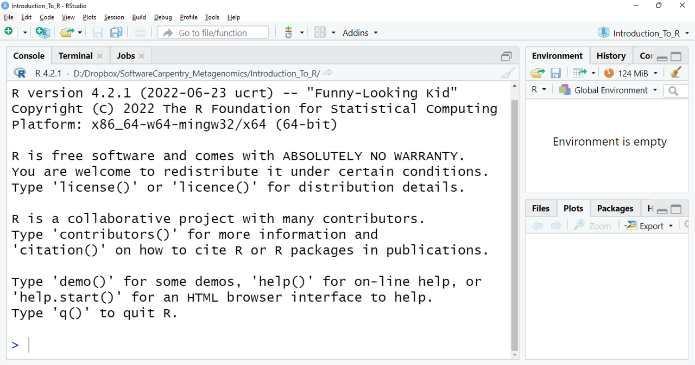
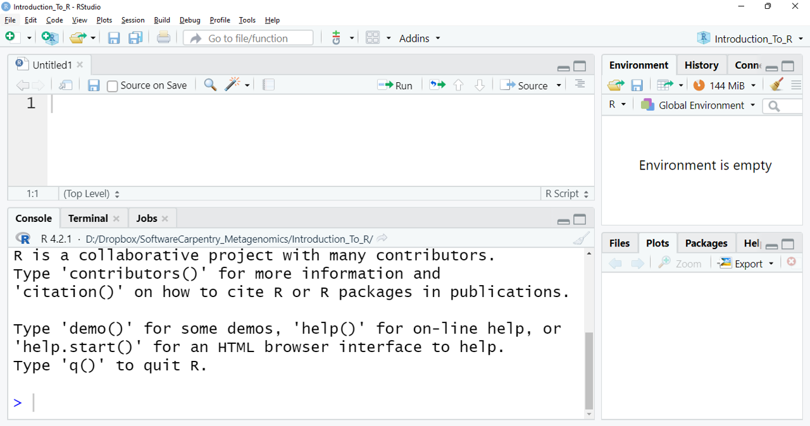

---
# First Steps with R

Questions:
- What is R, and why is important to learn to use it?
- What types of data does the R language have?

objectives:
- Understand why R is important.
- Describe the purpose and use of each panel in the RStudio IDE
- Locate buttons and options in the RStudio IDE
- Define a variable
- Assign data to a variable

keypoints:
- R is a programming language
- RStudio is a useful tool for script writing and data-management
- A variable can temporarily store data
---


*It takes courage to sail in uncharted waters*
  -Snoopy

## RStudio setup 

### What is R, and what can it be used for?

"R" is used to name a programming language that for statistical 
computing and graphics. RStudio is the most popular GUI program for script writing and interaction with R software.

R uses a series of written commands, which is great! 
If you rely on clicking, pointing, and remembering where to click, mistakes can happen.
Moreover, if you get more data, it is easier to just
*re-run* your script to obtain results. Also, working with scripts 
makes the steps you follow for your analysis clear and shareable. 
Here are some of the advantages of working with R:  

- R code is reproducible
- R produces high-quality graphics
- R has a large community
- R is interdisciplinary 
- R works on data of all colors and sizes
- R is free!

### What is an R Markdown notebook?

As we move into the data analysis phase of the class, we will begin to use R Markdown notebooks to guide you through how to perform data analysis and create visualizations. Similar to a Jupyter notebook, an R Markdown notebook allows you to integrate narrative text written in Markdown, interspersed with chunks of R code. When you run the code in the document, the R code is executed, and the results are inserted into the document, creating a seamless blend of text and code output. This makes it easy to create dynamic documents that include data analysis, visualizations, and explanations in a single, reproducible format.

The R Markdown file typically has the extension ".Rmd". To create an R Markdown document, you need an environment that supports R Markdown, such as RStudio (we will use RStudio from the UA HPC on demand site, more on that later).

### Getting started by setting a common package library

R uses a package manager to install libraries contributed by the user community. We will be using a number of these packages as we work through different exercises in our R markdown notebooks. To ensure a stable global environment for all students in the class, we will use a common repository where I have pre-installed the packages for the class with the correct versions and dependencies. In order to use this common library, you will need to create a file in your home directory to tell RStudio (on the on demand HPC) which library to use. To do this, go to a shell and copy/paste the following command:

```
echo 'R_LIBS=/groups/bhurwitz/R/library_R_v4.2.2' >> ~/.Renviron
```


### RStudio Integrated Development Environment(IDE)

Great! Now we are ready to get started with using RStudio.
RStudio is an [Integrated Development Environment(IDE)](https://en.wikipedia.org/wiki/Integrated_development_environment#:~:text=An%20integrated%20development%20environment%20(IDE,automation%20tools%20and%20a%20debugger.)) 
which we will use to write code, navigate around files on the HPC, try code, inspect the variables we create, and visualize our plots.

We will use the RStudio Integrated Development Environment (IDE) from [UA on demand portal](https://ood.hpc.arizona.edu/). You can get to RStudio, by selecting Interactive Apps -> RStudio Server from the main menu bar.

Here is what you may look at the first time you open RStudio:

<a href="../fig/Welcome_R.png" >
  
</a>


The figure shows the RStudio interface. The three windows that appear 
on the screen provide us with a space in which we can see our console
(left side window) where the orders we want to execute are written, observe 
the generated variables (upper right), and a series of subtabs (lower right): 
**Files** shows us files that we have used, **Plots** shows us graphics that we 
are generating, **Packages** shows the packages that we have downloaded, **Help** 
it gives us information on packages, commands, and/or functions that we do not 
know, but works only with an internet connection, and **Viewer** shows a results preview in R markdown files.

If we click on the option `File`/`New File`/`R Script`, we open up a script and we get what we can call an _RStudio nautical chart_

<a href="../fig/Welcome_Rscript.png">
  
</a>

RStudio interface with a new panel is shown. Clockwise from top left: Empty script,
Environment/History/Connections/Tutorial, Files/Plots/Packages/Help/Viewer,
Console/Terminal/Jobs. You can enter your online RStudio to see your environment.

### What is a working directory?

As we have seen in different lessons, maintaining related data in a single folder is desirable. In RStudio, this folder is called the **working directory**. It is where R will be looking 
for and saving your files. If you need to check where your working directory is located use `getwd()`.

From the console type:
```
getwd()
```

This should be your home directory on the HPC.

To change directories we can click on the blue gear icon:
<a href="https://user-images.githubusercontent.com/67386612/118722611-f7f59400-b7f1-11eb-8ca9-a72561f9c529.png">
  
</a> on the `Files` tab, pick the option _Set As Working Directory_. Alternatively, you can use the `setwd()` command for changing it.

Let's use these commands to set our working directory:

```
> setwd("/xdisk/bhurwitz/bh_class/YOUR_NETID/exercises/12_phyloseq")

```

## Having a dialogue with R

There are two main ways to interact with R in RStudio:
* Using the console.
* Creating and editing script files.

The console is where commands can be typed and executed immediately, and where the 
results from executed commands will be displayed (like in the Unix shell). If R is ready to accept commands, the R console shows
the `>` prompt. You can type instructions directly into the console and press "Enter", but they will be forgotten when you close the session.

For example, let's do some math and save it in R objects. We can store values in variables by using the assignment operator `<-`:
```
> 4+3
> addition <- 4+3
> subtraction <- 2+1
> total <- addition -subtraction
> total
```

What would happen if you exited out? Without the lesson page, can you remember what numbers the sum is made of in the variable `addition`?

To make our code **Reproducibile** we can save all of our steps as a script where we can run each line in the script by the shortcut `ctrl` + `Enter`. Where the command on the current line will be sent to the console and will be executed.

Time can be the enemy or ally of memory. We want to be sure to remember why we wrote the commands in our scripts, so we can leave comments(lines of no executable text) by beginning a line with `#`:

```
# Let's do some math in RStudio. How many times a year do the supermarkets change the bread that they use for
# display? if they change it every 15 days:
> 365/15
```

```
[1] 24.3333
```

