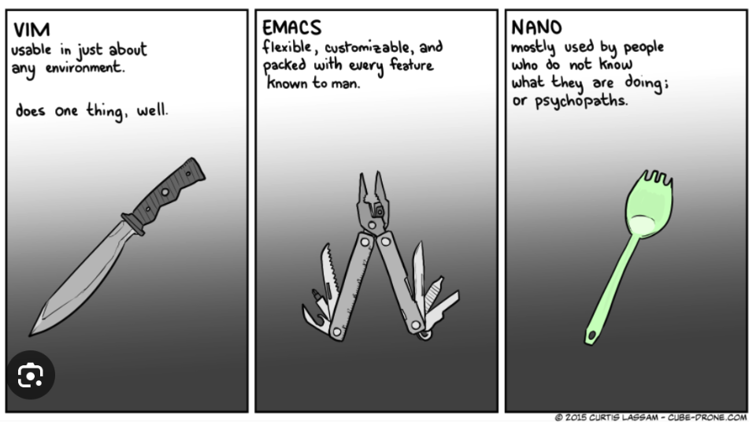

# Introduction

## The terminal
Make it comfortable to work in: 
* Resize the window
* Change the font size
* Open multiple terminal windows (or tabs)
* Make sure you have the right combination of colours that work for you.

## File organization
In UNIX, everything is organized in a hierarchy. Where we are and where we want to go is all organized in paths, which use the top to bottom hierarchy transformed into left to right, separated by the symbol /. 

In the below image, if we want to get the path to the Genomics folder within our user folder (Merce) we would get it by typing /home/Merce/Genomics.

Most of the time you spend using UNIX you will be within the folders of your /home/user folder, but it is important to understand the organization of the system in order to understand how to run things.

For example, why do we have three bin folders in the below representation?

/bin

/usr/bin

/home/Merce/bin

All these folders contain executable files. 

/bin contains commands that can be used by anyone, and that can be used even when the filesystem is not in place, as in repair modes or when booting. It also contains most of the basic commands we will see at the begining of our UNIX workshop.

/usr/bin contains all the applications or executables that are accessible by any of the locally logged users. The executables here are not required for the functioning of the system.

/home/Merce/bin is for scripts, code and a selection of programs that are used individually and not as often. Scripts and programs can be stored in any location, and we then use the entire path to them to execute them.

(image)

## Absolute vs Relative paths
An absolute path refers to the entire path to one location, for example: /home/Merce/Genomics. But we might be in a different location from the root already, and we might want to avoid writing the full path again and again. For that we use the relative paths. A key aspect to relative paths is the dot symbol .

. refers to our current location

.. refers to the location above us

For example, if we are in Genomics already, that is our ./

If we want to refer to the Merce folder from our Genomics location, the relative path would be ../

Imagine we are in the Genomics folder, and we want to go to the bin folder inside Merce folder. We can just type ../bin to go there, instead of the absolute path /home/Merce/bin.

## Time to practice yourself! Let's learn how to move arround the file system!
First things first, where are you? The following command will let you know the absolute path of your location:

pwd

So, now we know we are in /home/genomics/, let's get to the directory of today's unix workshop.

All the material of the UNIX workshop of today is located in /home/genomics/workshop_materials/unix 

We can move to the folder by typing:

cd /home/genomics/workshop_materials/unix

The command cd stands for change directory, and will allow us to move around the file system.

Notice that we just used the absolute path to go to our unix folder, but we were already inside genomics, so we could have typed: 

cd ./workshop_materials/unix 

If we want to go back to the parent directory of our current directory, we just need to type:

cd ..

The command cd can always easily take us back home (/home/genomics) with either option:

cd

cd ~

If we want to go back to the previous working directory where we were before the last cd, we type:

cd -

```
Are you typing? You are doing it wrong! Use the tab on your keyboard to autocomplete. 

Tab once to complete uniquely

Tab twice to see all possible completions

Arrow up scroll through previous commands
```

Let's take a look at what is inside this folder:

```
ls
```

ls will show you the contents the directory you are in.

Alternatively, one could have typed ls . or ls ./, given that, if we want to take a look at the contents of the Genomics folder, we can type ls ..

All commands will have a wide arrange of options to be used, and we access them by typing:

man ls

In this case, the manual of ls will be printed in your screen. Now we know that using different flags after ls, one can get different types of information.

For example, if we want a formatted list:

ls -l

Or if we want to view the hidden files in the folder:

ls -a

Sometimes we can combine flags, such as:

ls -lh

which lists all files in a formatted list, using human readable numbers for the file sizes.

Try them! Do we have any hidden file in the folder?

Key shortcuts

Ctrl + C				halts current command

Ctrl + Shift + C		copy (linux)	- 	Cmd + C (mac)

Ctrl + Shift + V		paste (linux)	-	Cmd + V (mac)

Ctrl + W				erases one word in current line

Ctrl + U				erases whole line

Ctrl + A				go to begining of line

Ctrl + E				go to end of line

Type exit			log out of current session

Create, copy, move, and remove files and folders
Let's create a directory inside the unix folder:

mkdir new_directory

Notice that we add an underscore symbol as a space. Try to avoid spaces in both filenames and folders, as some programs will not be able to interpret it correctly as one filename. You can choose the alternative that suits you better: newdirectory, NewDirectory, etc.

Let's copy file1 to new_directory:

cp file1 new_directory/

Now our file1 is both in unix and new_directory, but maybe we don't want it duplicated, the alternative is to use the mv command.


Move file2 to new_directory:

mv file2 new_directory/

Let's look at what we have in both folders:

ls 

ls new_directory/

You should see file1 in both locations, and file2 only in the new location. 


We can also copy entire directories, but if you try typing cp new_directory new_directory2, you will probably get an error message like this:

cp: new_directory is a directory (not copied).

To copy recursively directories and everything that they contain, we should use the flag -r 

cp -r new_directory new_directory2

Chek with ls, did it work this time? 


Ok, let's now remove all the duplicates! 

Let's first remove file1 from unix:

rm file1

To remove new_directory2 we also need to use the -r flag:

rm -r new_directory2

Notice that the rm command will not print any caution message: "are you sure you want to do this?", it will directly remove file1. Always work with caution before running your commands!

"Unix was not designed to stop its users from doing stupid things, as that would also stop them from doing clever things."  - Doug Gwyn

## Symbolic links
One way to keep files safe is to work in temporary directories and store back ups of the important data. 

A good trick to work with important data is to create symbolic links, also known as symlinks or soft links. A symlink will point to a file or a directory in a different location. 

Change directory to working_directory, inside the unix folder. We will use this directory to work with the files, while keeping them safe in their original location.

To create a symbolic link:

ln -s /home/genomics/workshop_materials/unix/new_directory/file2 /home/genomics/workshop_materials/unix/working_directory/

If we were already inside working_directory, we can just type:

ln -s /home/genomics/workshop_materials/unix/new_directory/file2 .  (Creates a symbolic link of file2 in your current directory) 

To check that it work, we can run the ls command with the -l flag:

ls -l ./working_directory/ or ls -l

The -> symbol after the file name shows the path the symlink points to.  

Now, repeat the same procedure with file1.

Inputs and outputs

stdin		It stands for standard input, and is used for taking text as an input.

stdout 		It stands for standard output, and is used to text output of any command you type in the terminal, and then that output is stored in the stdout stream.

stderr 		It stands for standard error. It is invoked whenever a command faces an error, then that error message gets stored in this data stream.

Visualize file content
Now we want to start looking at what our files contain.

First, we can get an idea of how big they are. This is sometimes important to avoid printing into our screen hundreds, or even thousands of lines. We can first take a look at the file sizes, with the ls -lh command. Now you probably know that file1 is smaller than file2. 


wc
We can get more detailed information with the command wc (word count).

To know how many lines a file has:

wc -l file1

To know how many words a file has:

wc -w file1

To know how many characters a file has:

wc -c file1

Repeat the procedure with file2.


less, cat, head, tail
To visualize the content of files in our terminal screen, we can use the command less:

less file1

less is a more complete version of the command more, with less allowing a wider arrange of possibilities to navigate through the file. A trick to remember it: "less is more". For the whole array of options in less, check the wikipedia page or its manual in the command line.

To quit less, we just press q.

Another command that will show us the complete contents of the file is cat. In this case, it will be printed as standard output directly in our terminal. 

cat file1

cat file2

Short files like file1 are ok to be visualized directly as stdout, but others, like file2, will fill our terminal with all its lines. But this command will be useful later on to redirect file contents to other commands! :) 

When working with larger files, sometimes we want to just quickly check its contents, instead of opening an entire huge file. For that, we have specific commands to check the begining or the end of the file:

head file2

tail file2

The default of head will print the first 10 lines of a given file, while tail will print the last 10 lines. But of course, we can modify the default number of lines using the flag -n <number>.

The character | (pipe) is used to concatenate commands, so that we can run one command after the other, avoiding the creation of intermediate files.

command1 input | command2 > output

Instead of :

command1 input > output1

command2 output1 > output2

Using pipe, the output of running command1 on a given input gets directly piped into command2, and we obtain an output of these two consecutive commands, generating only one output. 

A bit more advanced file-handling commands
Concatenate files
We can concatenate files by using the command cat command.

cat fileA fileB >> fileC

which could be also phrased as:

cat fileA > fileC

cat fileB >> fileC

The difference between using the redirect of output symbol > or >> is an important feature to always take into account. One symbol alone will rewrite anything that was previously on fileC. The two symbols would allow for the concatenation after the contents that are already on fileC.


Sort file contents
When having a series of lines in our file that we want to put on a certain order, we can use the command sort.

sort fileA

Additional options that can be very useful at times:

sort -r fileA			sorts in reverse order

sort -n fileA			sorts lines in fileA numerically

sort -k 2 fileA			sort fileA by column 2

We can put everything together:

sort -k 2nr fileA		sort fileA by column 2, numerically and in reverse order

You will soon realize that sort will fail in sorting nummerically when numbers are not written with a 0 in front, such as 1, 2, 3,..., 10,11,12... instead of 01, 02, 03, ..., 10, 11, 12... The flag -V will allow you to order them naturally!

sort -V fileA

sort -u fileA			sort lines of fileA and remove duplicates

The last command corresponds to the same action of piping the sort command into the uniq command

sort fileA | uniq	


Are these two files different?
When we have been modifying files, it is good to check in which things they differ, so that we can recall which changes were made. The command diff can tell us if there are differences between two files. The flag -q will quickly check if there is differences:

diff -q fileA fileC

If they are different, in will print: Files fileA and fileC differ

If they are the same, it won't print anything.

If we want to see the specific changes, we would run the command without a flag:

diff fileA fileC


Splitting a file
The command split can let us split a given file into multiple files. The default split is 1000 lines per file, but we can create our own split by typing:

split -l 20 fileA

This command will produce x number of files from fileA, each containing 20 lines.


Another way to extract specific parts of a file is by using the command cut. This command can be used, for example, to extract specific columns from a file:

cut -c 2 fileA


Let's practice these commands with file2 in your unix directory:
 Let's create a new_file1 that contains two times the contents of file2! 

Take a look at the contents of the file (use less, head, tail...)

Are they in order? If not, let's sort the contents! Save it in a new_file2.

Is the order ok? Do we need some special sort flag to get a natural order?

Check how the new_file2 differs from the original file2, and how new_file2 differs from new_file1.

We can also use the uniq command so that new_file2 will look again like file2.

Split new_file2 into 2 files! How many lines should we put in each file? What about if we want to split file2 in two files?

Finally, extract only the number from every line!

Text editors
There is also ways to edit your file directly inside a text editor. There is a range of options, and people's preferences vary a lot depending on what they are used to. 

nano
The simpler option is nano, you start it by simply typing:

nano file1

All commands within the nano text editor are given by pressing the Control-key, usually represented as ^. The most important commands are written here, but you can find the whole arrange in the nano webpage.

^S		save current file

^O		save to (a different file)

^X		exit from nano


vim
The text editor Vim is a highly configurable text editor built to make creating and changing any kind of text very efficient. You can start it by typing:

vim file1

Some of the most important commands are listed below, but you can find all the possible combinations in different online cheatsheets:

i		start insert mode (you can start typing after where your cursor is)

ESC	exits insert mode (also Ctrl + C)

:w		save file without exiting

:q		exit file (if there are unsaved changes, it fails)

:wq	save and exit

:q!		exit without saving changes


emacs
The text editor emacs is also characterized by its extensibility and configurability. You can start emacs by typing:

emacs file1

Some esential commands commands get activated by typing Control + X, then the command (while holding the control key), but there is a wide range of key combinations to be used to move and edit the text:

Ctrl + x + s	save file

Ctrl + x  + c	exit editor (if not saved, it ask if you want to save, then type "yes")


Time to interact!
Find someone in the room that uses a different text editor than you, and try to explain to each other some of your most useful commands you use! If you still have not picked your favourite text editor, get to learn from one of them from someone around you!

Some bioinformaticians feel very strongly about their own "best text editor", and you will sometimes encounter funny comics like the one below. In the end, use whatever feels more comfortable to you! 




## Adapted
[Adapted from the Evomics Workshop](https://sites.google.com/view/wg2023unix/unix-introduction?authuser=0)
